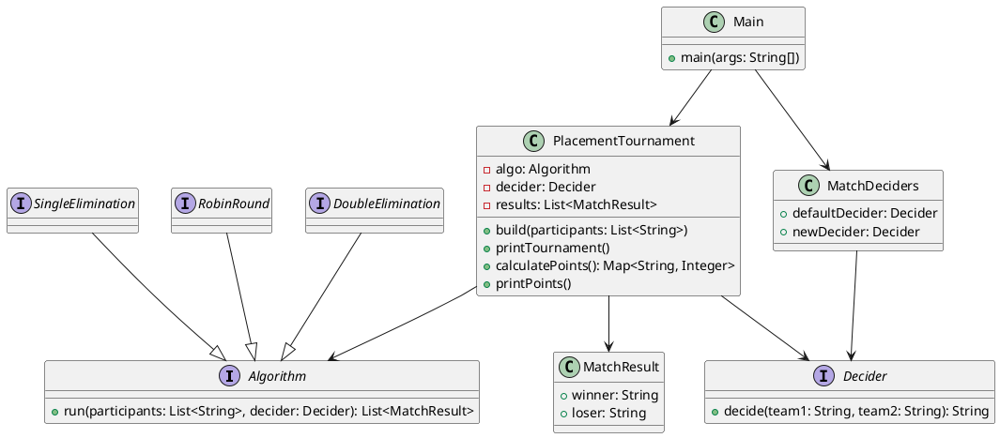
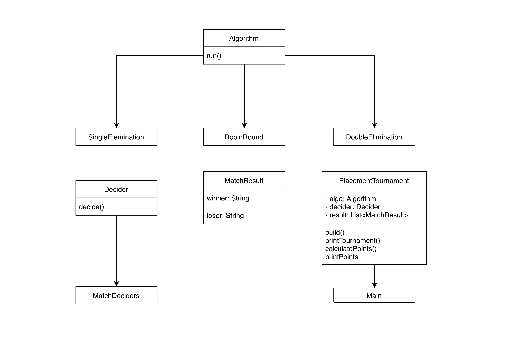
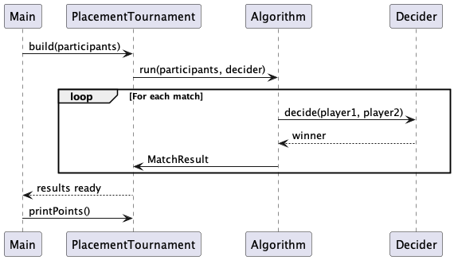

# LukOilNeftohim - Tournament System   

## 1. Преглед на проекта

Проектът представлява система за симулация на турнири чрез наличието на множество турнирни формати:

* **Single Elimination**
* **Round Robin**
* **Double Elimination**

Системата е изградена с помощта на **functional interfaces**, **lambda expressions** и **strategy-based design**, което позволява свободното комбиниране на всеки турнирeн `Algorithm` и всяка функция за решаване на мачовете (`Decider`).

---

## 2. Архитектура

Проектът следва следния изпълнителен поток:

```
Main
 → PlacementTournament
     → Algorithm (SingleElimination / RobinRound / DoubleElimination)
         → използва Decider
             → произвежда списък от MatchResult
```

Този дизайн осигурява:

* **Loose coupling** между логиката на турнира и логиката за определяне на победител
* Лесна смяна на турнирни формати
* Детерминирани или случайни резултати

---

## 3. Документация по файлове

### 3.1 Algorithm.java

```java
@FunctionalInterface
public interface Algorithm {
    List<MatchResult> run(List<String> participants, Decider decider);
}
```

**Предназначение:**
Дефинира договор (contract) за всички турнирни алгоритми.

**Основни характеристики:**

* Functional interface → може да се реализира чрез lambda
* Приема участници и `Decider`
* Връща всички резултати от мачове

---

### 3.2 Decider.java

```java
@FunctionalInterface
public interface Decider {
    String decide(String team1, String team2);
}
```

**Предназначение:**
Определя победителя между двама участници.


---

### 3.3 MatchResult.java

```java
public record MatchResult(String winner, String loser) {}
```

**Предназначение:**
Съхранява резултата от един мач.

**Защо е използван `record`:**

* Immutable (непроменяем)
* Автоматично генерирани getters
* По-чист и кратък код

---

### 3.4 PlacementTournament.java

Отговаря за изграждането, съхраняването, отпечатването и точкуването на турнира.

**Основни отговорности:**

* Стартира избрания `Algorithm`
* Съхранява всички `MatchResult`
* Отпечатва всички мачове
* Изчислява класиране чрез точкова система

**Важни методи:**

* `build(List<String>)`
* `printTournament()`
* `calculatePoints()`
* `printPoints()`

---

### 3.5 SingleElimination.java

Имплементира класически турнир тип директна елиминация.

**Поведение:**

* Участниците се сдвояват рунд по рунд
* Загубилият отпада директно
* При нечетен брой участници първият получава автоматично преминаване напред

---

### 3.6 RobinRound.java

Имплементира пълен Round Robin турнир.

**Поведение:**

* Всеки участник играе срещу всеки друг
* Победи и загуби се следят вътрешно
* Резултатите се връщат като списък от `MatchResult`

---

### 3.7 DoubleElimination.java

Имплементира система с два потока (brackets).

**Поведение:**

* При първа загуба участникът преминава в losers bracket
* При втора загуба участникът отпада
* Финалният мач определя крайния шампион

---

### 3.8 MatchDeciders.java

Съдържа предварително дефинирани реализации на `Decider`.

**Полетa:**

* `defaultDecider` → случаен победител
* `newDecider` → детерминиран примерен decider

---

### 3.9 Main.java

Входна точка на програмата.

**Отговорности:**

* Дефинира участниците
* Избира `Decider`
* Стартира различните турнирни формати
* Отпечатва резултатите

---

## 4. Използвани Design Patterns

### Strategy Pattern

* `Algorithm` и `Decider` са взаимозаменяеми стратегии.

### Functional Programming

* Реализация чрез lambda expressions
* Минимално количество boilerplate код

### Immutable Data

* `MatchResult` е immutable чрез `record`

---

## 5. Примерен изпълнителен поток

1. `Main` дефинира участниците
2. `Decider` определя победителите
3. `PlacementTournament` стартира избрания `Algorithm`
4. Всеки алгоритъм създава `MatchResult` обекти
5. Точките се изчисляват и се извежда класирането

---

## 6. Разширяемост на системата

Могат лесно да се добавят:

* Swiss-system tournament
* Group-stage турнири
* Playoffs
* Seeding системи
* Tie-break алгоритми

Достатъчно е да се имплементира:

```java
Algorithm NEW_ALGO = (participants, decider) -> { ... };
```

---


## 7. UML-Style Диаграми

### 7.1 UML Class Diagram (Textual / PlantUML)



---

### 7.2 Опростена UML диаграма



---

### 7.3 UML Sequence Diagram – Поток на изпълнение


